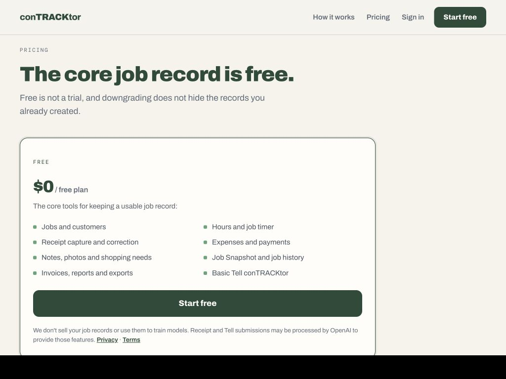

# Free tier copy audit

## Verdict

The suggested strategy is sound—publish real limits clearly—but the proposed numbers are not currently product truth. The live entitlement definition gives Free both `core.jobs` and `tell.basic` with no numeric limit, the Tell service does not consume a monthly usage counter, and the subscription plan explicitly defers exact AI limits until real usage is measured.

Publishing “3 active jobs” or “30 Tell submissions / month” now would create the trust problem the copy is trying to avoid.

## Step 1 — Read the Free plan at the decision point

**Health: Good presentation; one important clarity gap.**

- The card is visually clear, scannable, and balanced. It does not need a redesign.
- The feature list communicates inclusion, but “Basic Tell conTRACKtor” is vague.
- The card does not literally claim unlimited use. However, it also does not explain that AI usage may eventually have a ceiling.
- A three-active-job cap would conflict with the existing product boundary that Free preserves complete job truth. It may also stop a contractor from recording legitimate current work—the exact failure conTRACKtor promises to prevent.
- The strongest sustainable upgrade boundary is intelligence and automation, not access to a contractor's core job record.

## Recommended copy direction

Keep the current card structure and do not publish invented limits.

- Change “Basic Tell conTRACKtor” to “Tell conTRACKtor for hours, notes and shopping.”
- Keep jobs and recordkeeping useful without an announced active-job cap unless the product decision and enforcement both change.
- Use the planned-plan line to establish the upgrade story: “Pro is planned for higher Tell usage, deeper automation, and help spotting what needs attention. Business adds crew workflows. Your Free job history stays yours.”
- Once a Tell allowance is selected and enforced, replace the descriptive Tell line with the exact monthly quantity everywhere at the same time.

## Evidence limits

The visual review covers the desktop pricing state shown above. Keyboard behavior, screen-reader announcements, and contrast were not re-audited in this pass. Product-limit findings come from the repository's current entitlement definitions and Tell enforcement path, not from the screenshot alone.
