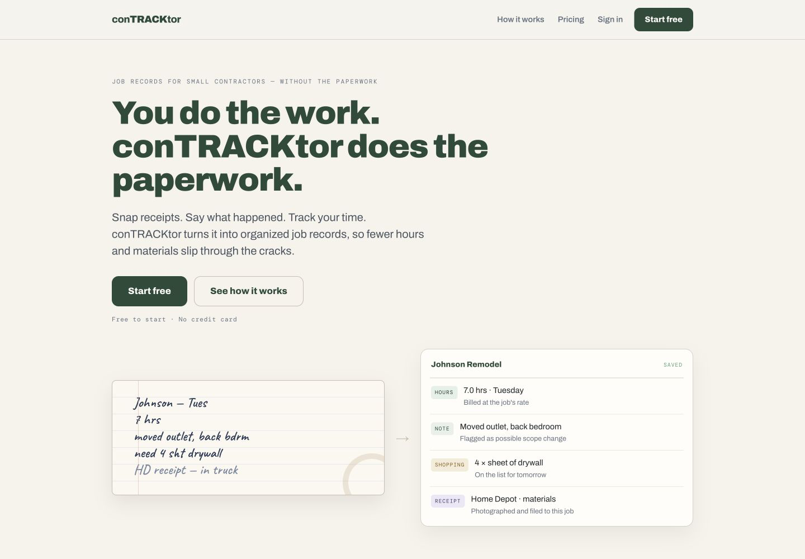
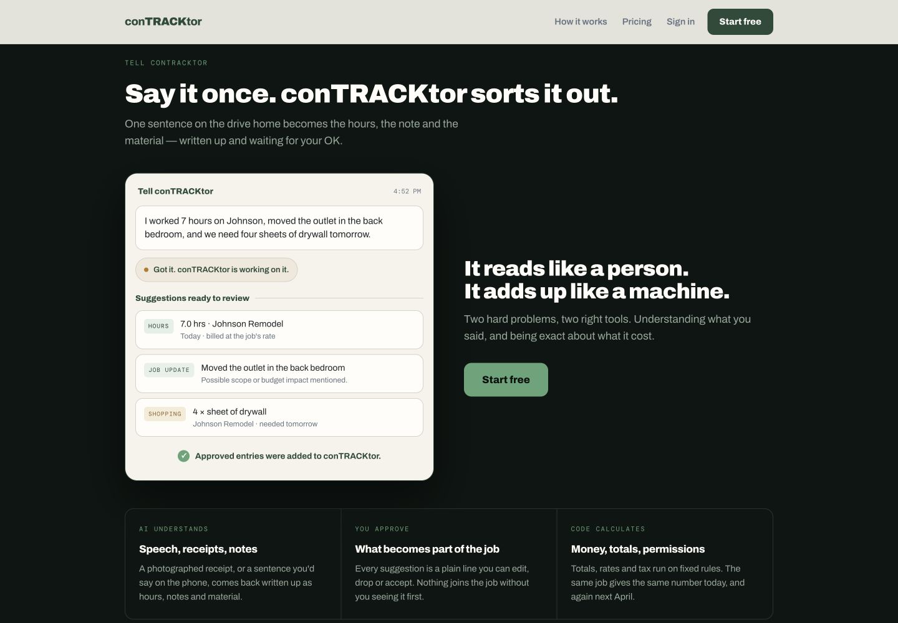
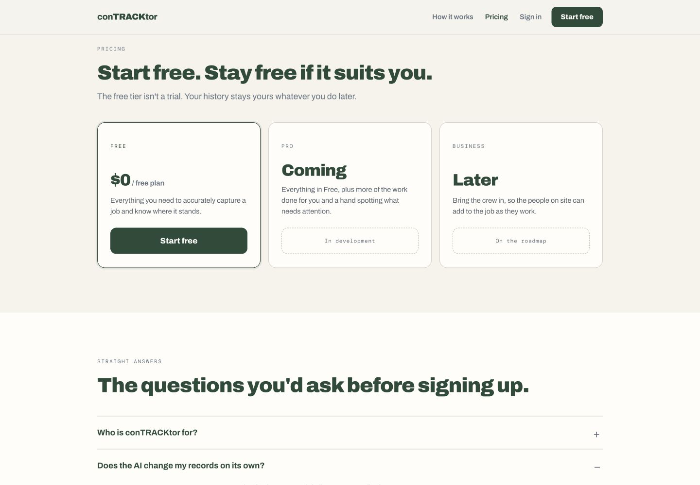
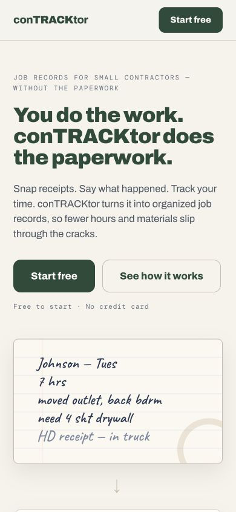

# conTRACKtor landing-page audit

## Audit scope

Combined UX, conversion, responsive-design, and accessibility review of `index_5.html` at desktop (1440×1000) and mobile (390×844).

## Overall verdict

This is a strong, unusually specific landing page with a coherent visual identity and convincing product storytelling. It feels much closer to a real product than a generic AI-generated SaaS page. The main weaknesses are launch readiness, excessive length/repetition, and missing trust evidence.

## Evidence

### 1. Desktop hero — healthy

- The audience, pain, and promise are clear within seconds.
- The handwritten-note-to-job-record transformation is excellent product proof.
- The primary and secondary actions are easy to distinguish.
- The warm paper/forest palette and typography fit the audience without leaning on contractor clichés.

### 2. Core product explanation — healthy, with one motion issue

- This is the strongest section after the hero. It shows the input, the proposed records, and the human approval step.
- “It reads like a person. It adds up like a machine.” is memorable and differentiates the product.
- The demo animation begins on initial page load, while this section is offscreen. Most visitors will reach it after the sequence has finished, so the intended reveal is usually missed.
- “Approve all” looks interactive but has no click handler; the demo changes state automatically.

### 3. Pricing and FAQ — needs work

- The free-plan promise is clear and reassuring.
- The plan copy does not define limits, so “everything you need” is difficult to evaluate.
- Two unavailable tiers dominate two-thirds of the pricing area and make the product feel earlier-stage than the rest of the page.
- There is no customer proof, privacy/security reassurance, or Terms/Privacy link near the decision point.

### 4. Mobile hero — good, but proof lands late

- The headline, copy, and buttons reflow cleanly with usable touch targets.
- The transformed result card falls below the first mobile viewport, so the hero shows the messy input but not yet the payoff.
- Mobile navigation removes How it works, Pricing, and Sign in. The focused layout is clean, but returning users must travel to the footer for Sign in.

### 5. Signup path — blocked

- All seven `Start free` links and both `Sign in` links resolve to `#` because the `APP` base URL is empty.
- Clicking the hero CTA leaves the visitor at the top of the same page.
- The calculator works correctly: `$100/hour`, `2` missed hours/week, and `$100` unbilled materials/month produce `$11,200` per year.
- No console warnings or errors were observed.

## Highest-impact changes

1. Wire the signup and sign-in routes before launch. This is the only true release blocker.
2. Cut approximately 30–40% of the page. The current page has 12 sections and about 1,567 words. Merge “The plan,” “Three ways in,” and the receipt flow; retain the hero, voice demo, Job Snapshot/invoice outcome, calculator, pricing, focused FAQ, and final CTA.
3. Add trust evidence at the decision point: one real customer quote or beta result, a concise data-handling statement, and Privacy/Terms links.
4. Define the free tier in concrete terms. If Pro and Business are not close to release, reduce their visual prominence or replace them with one short roadmap note.
5. Trigger the voice demo when it enters the viewport, or make it a real replayable interaction. Do not show an inert button that appears clickable.
6. On mobile, compress the transformation example so both the handwritten input and organized result appear earlier.

## Accessibility notes

Strong foundations include `lang="en"`, semantic sections and headings, labeled calculator inputs, a visible focus treatment, reduced-motion handling, and hidden decorative arrows.

Likely issues:

- `#667382` on `#F6F3EC` measures about 4.37:1, slightly below the 4.5:1 target for normal text. This affects small eyebrow and reassurance text. `#5F6B79` would improve the ratio to about 4.90:1.
- There is no skip link before the sticky navigation.
- The calculator heading jumps from `h2` to `h4`.
- Full keyboard, screen-reader, 200% zoom, and forced-colors testing were not completed, so this is not a compliance claim.

## Recommended shorter page order

1. Hero and transformation proof
2. Voice-to-record demo
3. Job Snapshot and invoice outcome
4. Loss calculator
5. Free-plan offer plus trust evidence
6. Five-question FAQ
7. Final CTA

