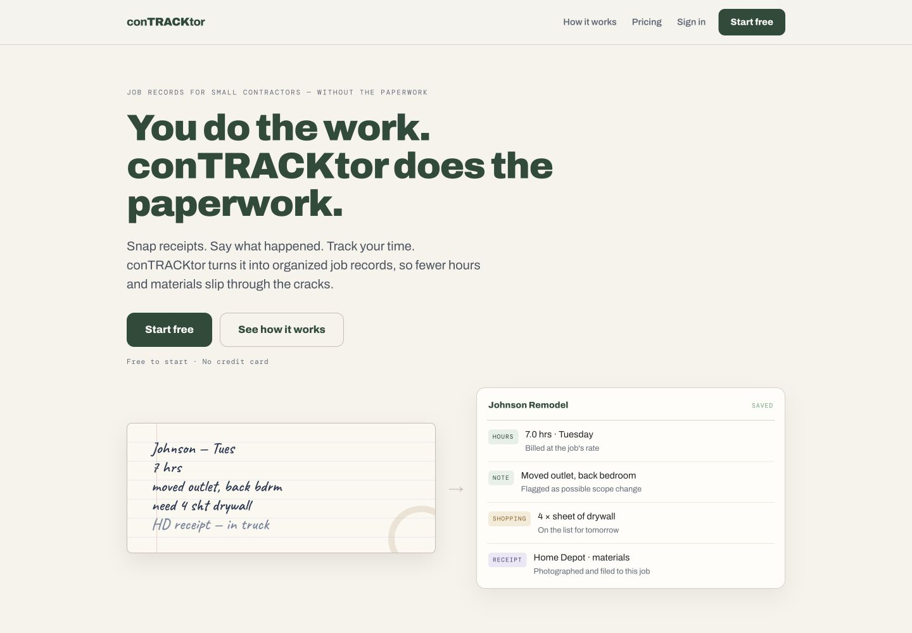
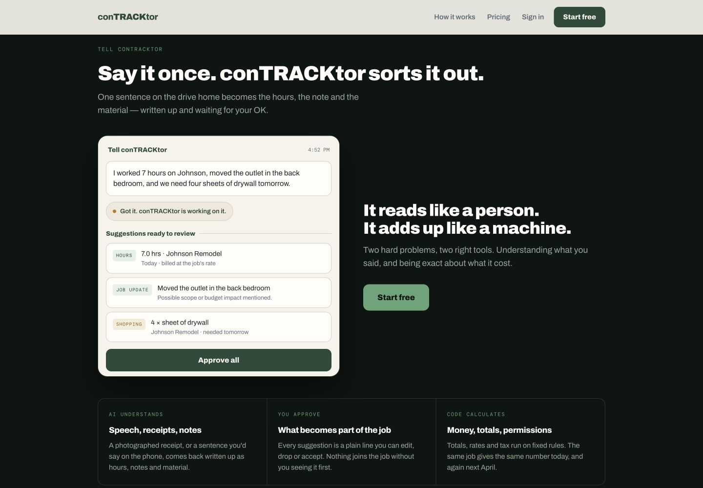
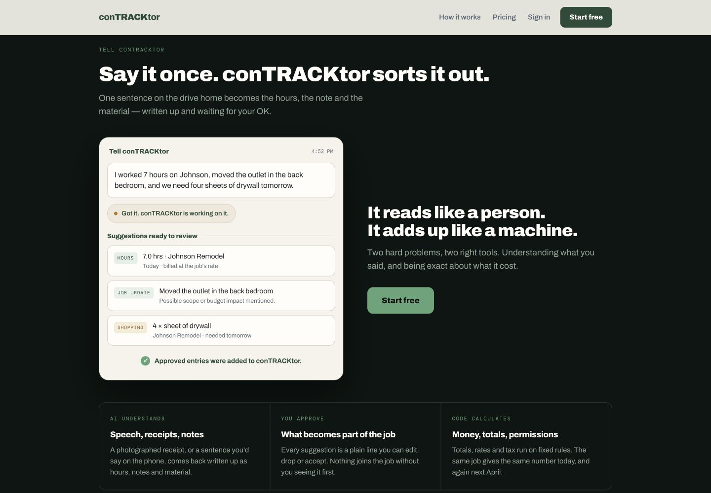
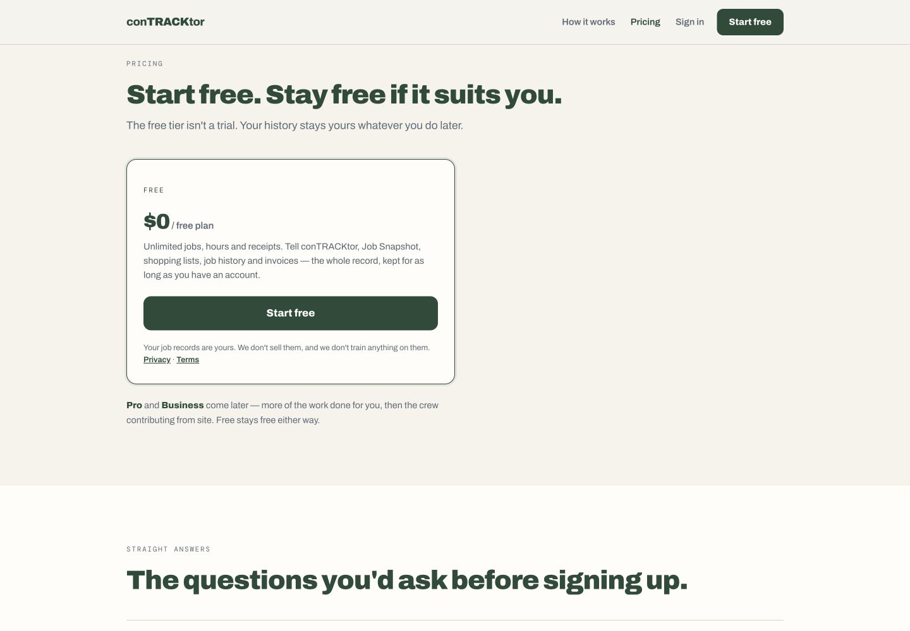
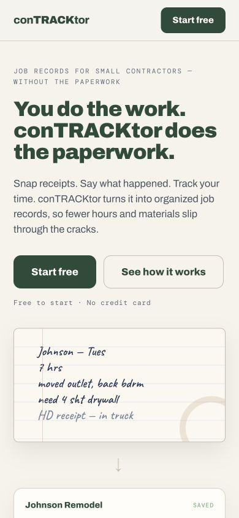
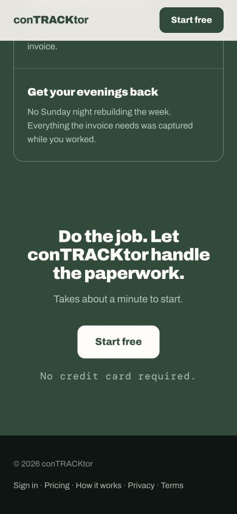

# conTRACKtor landing-page re-audit

## Verdict

The revision fixes the most important problems from the first audit. The animation now plays at the right moment and can be replayed, both contrast failures are fixed, the redundant capture section is gone, mobile proof arrives earlier, and the pricing copy is substantially more useful.

Two important issues remain: replay is pointer-only and hidden from assistive technology, and the new desktop pricing layout feels visually unfinished because a 520px card is left aligned in a 1,120px content area.

## Evidence

### 1. Desktop hero — healthy

- The original positioning and transformation proof remain intact.
- The darker muted color improves small-text contrast without changing the visual character.

### 2. Tell demo — behavior fixed, accessibility needs one more pass

- Before the section enters the viewport, the demo has no `run` class and its animated content remains hidden.
- At 40% visibility, the animation starts. It completes in the intended approved state.
- Clicking the demo successfully resets and replays the sequence.
- The replay surface is a `div` with `cursor:pointer`, `title="Replay"`, `tabIndex=-1`, and `aria-hidden="true"`. Pointer users can replay it, but keyboard and screen-reader users cannot discover or trigger replay. The entire concrete product example is also hidden from the accessibility tree.
- Recommended fix: expose the content to assistive technology and provide a real `Replay demo` button tied to the animation. Keep the staged `Approve all` element noninteractive if it is only part of the illustration.

### 3. Pricing — clearer content, visually unbalanced on desktop

- The free plan is now concrete and the roadmap no longer competes with the available offer.
- The data-handling sentence and policy links appear at the correct decision point.
- The card is not actually full width: `.tier.solo` has `max-width:520px` and is left aligned inside a 1,120px container. The unused right half makes the section feel incomplete.
- Center the card and roadmap, or use a wider two-column card with price/action on one side and included features/data reassurance on the other.
- `/privacy` and `/terms` do not exist anywhere in the workspace yet.

### 4. Mobile hero — improved

- Reduced spacing and handwriting size bring the organized `Johnson Remodel — Saved` result into the first viewport.
- The page still hides Sign in, Pricing, and How it works from mobile navigation. Sign in remains available only at the bottom for a new visitor.

### 5. Closing reassurance — contrast fixed

- `#ACC0B2` on `#294B38` measures 5.068:1.
- The closing CTA and reassurance now read cleanly on mobile.

## Claim verification

| Claim | Result |
|---|---|
| Muted text changed to 4.90:1 | Verified: 4.902:1 on paper |
| Closing reassurance changed to 5.07:1 | Verified: 5.068:1 |
| Animation waits for 40% visibility | Verified |
| Click replays the animation | Verified for pointer input |
| Three Ways In removed and folded into Plan | Verified |
| Pricing consolidated and free plan defined | Verified |
| Revised page contains 1,499 words | Verified; the earlier file measured 1,567 with the same method |
| Both workspace copies updated | Verified byte-for-byte identical to `index_6.html` |
| Privacy and Terms pages are missing | Verified |
| CTA destinations are controlled by one empty `APP` value | Verified |

## Remaining priorities

1. Make replay keyboard- and screen-reader-accessible.
2. Create and legally review Privacy and Terms pages before collecting signups.
3. Set `APP` when the hosting/app URL is chosen.
4. Rebalance the desktop pricing layout.
5. Keep the current length for now, then use scroll depth and CTA-click data to decide what else deserves cutting.

## Evidence limits

This pass verified desktop and mobile rendering, pointer replay, source semantics, contrast math, links, file parity, and console output. It did not include a full screen-reader session, forced-colors mode, 200% zoom, or legal review of the data-handling claims.

