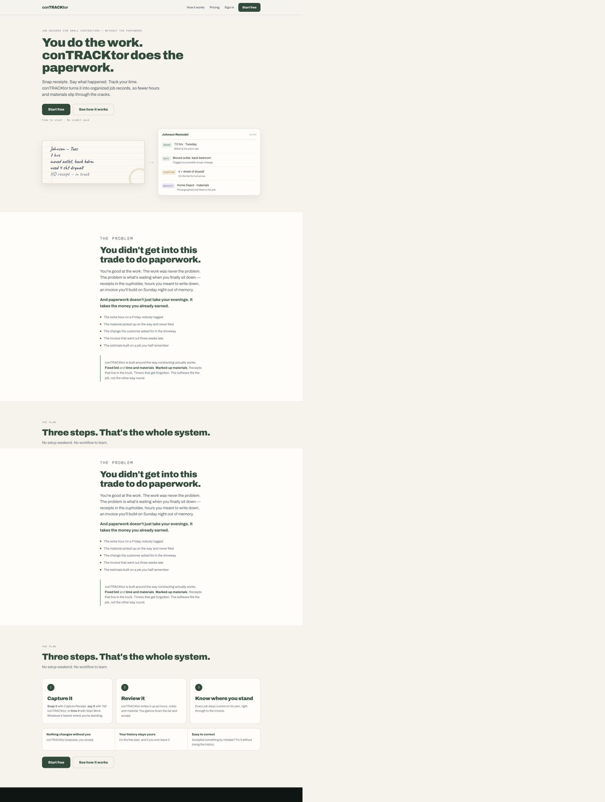
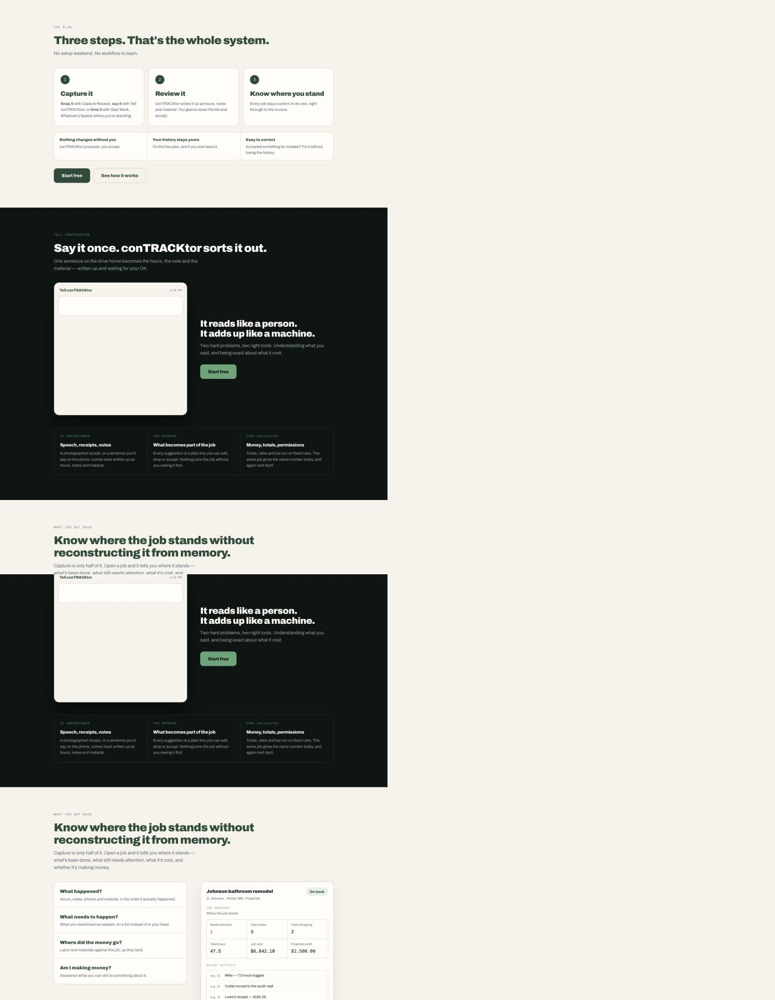
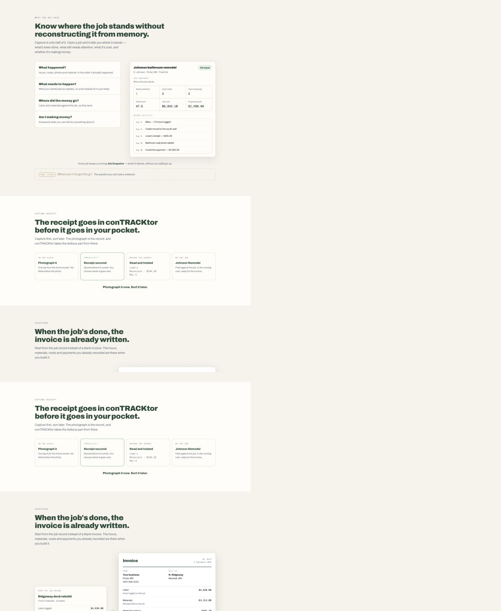
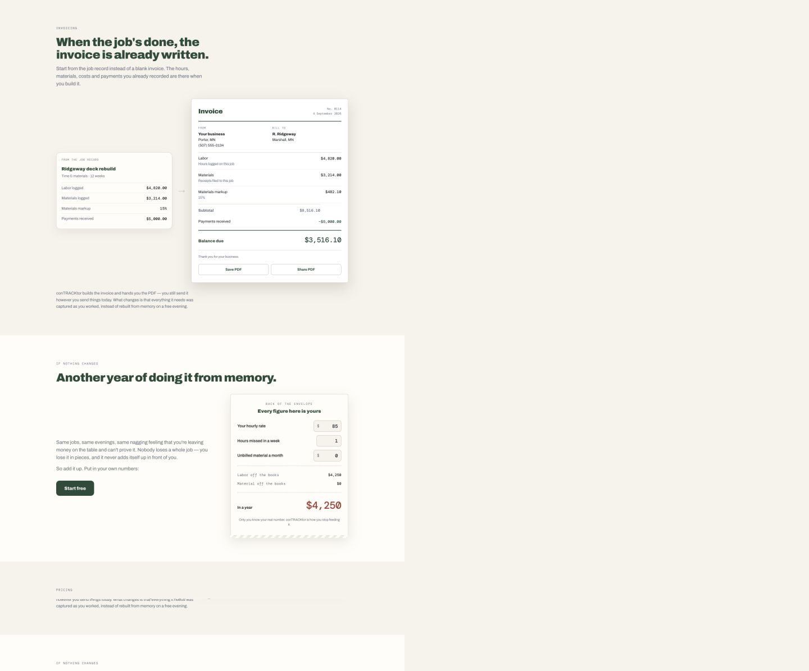
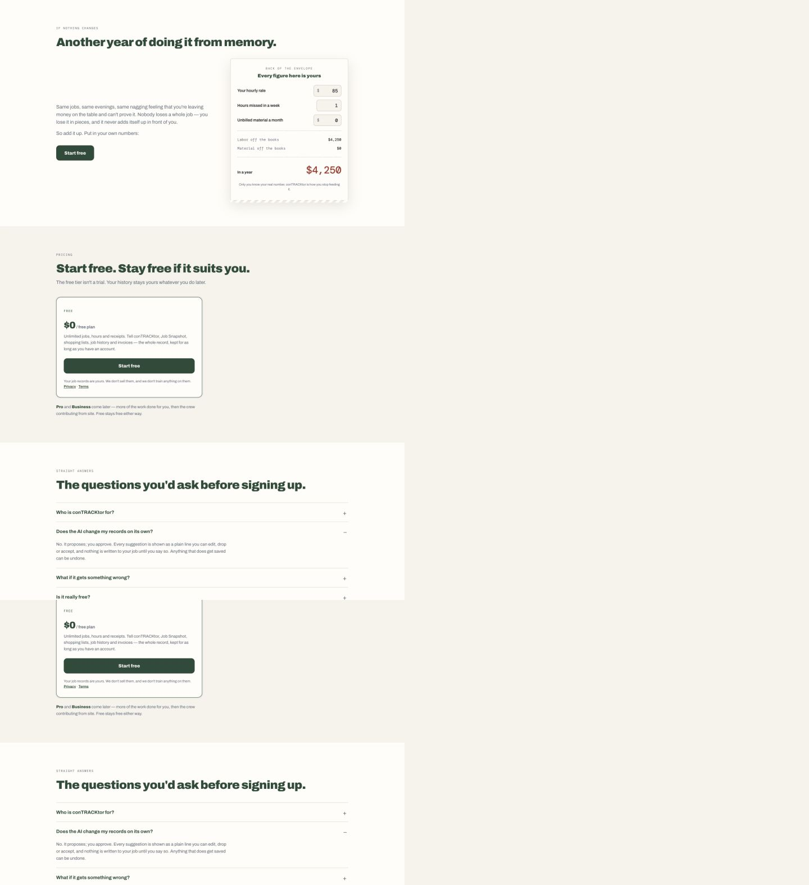
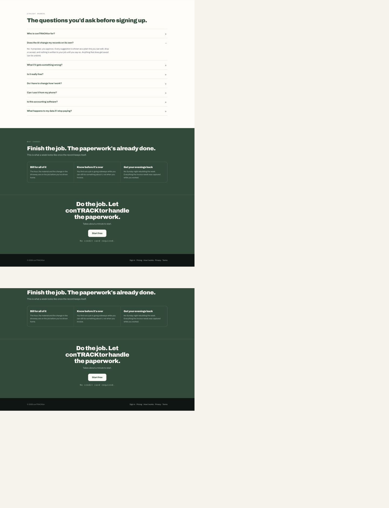

# conTRACKtor landing-page copy audit

Audited September 1, 2026 from the current local page at `marketing/index.html`.

## Verdict

The page has a strong voice, a believable product, and several excellent contractor-specific details. It is not ready for a final copy pass yet because it says the same core idea too many times and occasionally turns a good benefit into an absolute promise.

The best single positioning line is:

> Capture the job as it happens. Stop rebuilding it later.

That sentence should govern the rest of the page. The page should move through one clean argument:

1. Work disappears when it never reaches the job record.
2. conTRACKtor makes the record easy to capture while the work is happening.
3. The record gives the contractor a clearer job picture and a better starting point for the invoice.
4. The contractor remains in control of anything consequential.

The current page is 1,492 visible words. On a 390 × 844 mobile viewport it is about 13,640 pixels tall. The copy should lose roughly 20–25%, mostly by removing repeated claims rather than removing product proof.

## The proposed Problem copy

The second suggested headline is better:

> A lot of good work never makes it into the record.

It names the actual failure, introduces the product category—job records—and avoids using “paperwork” for a second headline immediately after the hero.

The first version has the better opening scene. The receipt, the extra hour, and the driveway change are concrete and recognizable. The second version has the better close: “Capture the job as it happens. Stop rebuilding it later.”

The best version is a hybrid:

### Recommended Problem section

**THE PROBLEM**

## A lot of good work never makes it into the record.

The receipt gets shoved in the truck. The extra hour never gets written down. The customer asks for one more thing in the driveway. By the time you sit down to invoice, you’re rebuilding the job from memory.

**If it never gets captured, tied to the job, and carried into the invoice, you may never get paid for it.**

- An hour that never got logged
- A receipt still sitting in the truck
- Materials that never got tied to the job
- Extra work that never reached the invoice
- A finished job you can’t learn from later

conTRACKtor is built for fixed bids, time and materials, marked-up materials, last-minute changes, forgotten timers, and receipts that show up wherever the work happens.

**Capture the job as it happens. Stop rebuilding it later.**

Why this is stronger:

- “Never get paid for it” is clearer and more human than “the business may never get credit for it.”
- “Small jobs leak time, money, and attention” is removed because it is vague and can imply the product is only for small jobs.
- “Slipping through the cracks” is removed here because the hero already uses it.
- The final line becomes the page’s central promise without claiming that conTRACKtor does everything automatically.

## High-priority findings

### 1. The page repeats the problem after it has already made the point

“Paperwork,” “rebuilding from memory,” and “where the job stands” recur across the hero, Problem, Job Snapshot, invoice, calculator, outcome, and final CTA. Repetition should build conviction; here it slows the page down.

Keep the full emotional story in the Problem section. Later sections should prove the solution with concrete features. The calculator needs only a short setup, and the outcome section should not restate the entire hero.

### 2. Several lines sound good but overstate what the product does

These should change before launch:

| Current copy | Problem | Better direction |
|---|---|---|
| “Every job stays current on its own” | The record only stays current when work is captured; “on its own” overclaims. | “As you capture the work, the job record stays current.” |
| “Nothing changes without you” | Too broad. Receipt capture and background extraction do create or update system state. | “AI proposals stay under your control.” |
| “The invoice is already written” | conTRACKtor prepares a draft from the record; the invoice is not literally final. | “By invoice time, the job is already written down.” |
| “The record keeps itself” | The contractor still has to capture or describe reality. | “Once you capture the work as it happens.” |
| “Bill for all of it” | An absolute outcome the product cannot guarantee. | “Miss less billable work.” |
| “The figures…are exact every time” | Fixed rules can be deterministic, but the inputs or assignments can still be wrong. | “Rates and totals are calculated by code, not guessed by AI.” |
| “The paperwork’s already done” | Strong rhythm, inaccurate result. | “The job closes with fewer loose ends.” |

### 3. The page sometimes chooses clever language over precise language

“It reads like a person. It adds up like a machine.” is memorable, but it blurs the division the following copy tries to explain. A more credible version is:

> AI understands the update. Code handles the numbers.

Then explain it in one sentence:

> conTRACKtor uses AI to prepare records from your words and photos. Rates, totals, tax, and permissions follow fixed rules.

This is plainer, but the credibility gain is worth more than the slogan.

### 4. Pricing copy is making commitments the tier document does not fully support

The internal tier definition says Free includes the core truth layer, but it also says exact AI usage limits are not final and feature allocations can change. The landing page currently promises “Unlimited jobs, hours and receipts” and “Free stays free either way.” Those are durable commercial promises.

Use capability language unless the business has deliberately committed to those guarantees:

> Create jobs, track hours, capture receipts, keep notes and shopping needs, and build invoices and reports. Free is not a trial, and downgrading does not hide the records you already created.

The trust line should also separate conTRACKtor’s behavior from third-party processing:

> We don’t sell your job records or use them to train models. Receipt and Tell submissions may be processed by OpenAI to provide those features. [Privacy] · [Terms]

That is more transparent than “we don’t train anything on them,” which is vague about who “we” includes.

### 5. The phone answer should describe the product people are actually using

The current FAQ says it works on a phone and in a laptop browser. That undersells the installed web-app experience and leaves the navigation concern unanswered.

Recommended answer:

> **Can I use it from my phone?**  
> Yes. Open conTRACKtor in your phone’s browser and add it to your Home Screen. It launches like an app and opens straight into conTRACKtor. The same account works in a desktop browser.

This copy should remain true after the marketing/app domain split: the installed app opens the product directly, while the public domain is the landing page.

## Section-by-section audit

### 1. Hero — good foundation; sharpen the product promise

**Health: Good, with a credibility edit needed.**

“You do the work. conTRACKtor does the paperwork.” is catchy but broader than the active product. conTRACKtor captures and organizes the job record; it does not yet handle every kind of contractor paperwork.

Recommended version:

**JOB RECORDS FOR SMALL CONTRACTORS**

## You do the work. conTRACKtor keeps the record.

Snap the receipt. Say what happened. Start the timer. conTRACKtor organizes the hours, materials, notes, and costs by job—so they’re there when you invoice.

This introduces the category immediately and replaces the abstract “organized job records” with the actual things the user cares about.

### 2. Problem — strong raw material; rewrite

**Health: Needs revision.**

Use the recommended hybrid above. It is more specific, less repetitive, and better connected to the product.

Small language notes:

- Use “the other way around,” not “the other way round,” for the primary U.S. audience.
- Prefer “materials” to singular “material” when describing multiple purchases.
- Use “Sunday night” once on the page at most; it loses force when repeated.

### 3. Plan — clear structure; remove two overclaims

**Health: Good structure, mixed accuracy.**

Keep “Three steps. That’s the whole system.” and “Whatever’s fastest where you’re standing.” Both are excellent.

Change “No setup weekend. No workflow to learn.” Every product has some learning, and “no workflow” contradicts the three-step workflow immediately below it. Better:

> Start with the job in front of you.

Suggested card copy:

1. **Capture it.** Snap a receipt, tell conTRACKtor what happened, or start the timer—whatever is fastest where you’re standing.
2. **Check it.** Review what conTRACKtor prepared, correct anything that is wrong, and approve what matters.
3. **See where you stand.** As you capture the work, the job record and Job Snapshot stay current.

Replace “Nothing changes without you” with “AI proposals stay under your control.”

### 4. Tell conTRACKtor — excellent proof; simplify the explanation

**Health: Strong.**

“Say it once. conTRACKtor sorts it out.” and the animated example are among the page’s best moments. Keep them.

Tighten the supporting copy:

> One sentence becomes proposed hours, a job note, and a shopping item—ready for you to review.

Use “AI understands the update. Code handles the numbers.” for the technical explanation. Avoid implying that every AI-assisted action always waits for approval; describe Tell proposals specifically.

### 5. Job Snapshot — valuable product proof; qualify the financial promise

**Health: Strong feature, overconfident copy.**

Recommended headline:

> See where the job stands before invoice day.

Recommended supporting copy:

> Open a job to see what has been recorded, what needs attention, what it has cost, and what the current numbers say.

“Am I making money?” can remain as the user’s question, but the answer should be grounded in recorded data:

> See recorded costs against the bid while there is still time to act.

This avoids suggesting that incomplete records can produce a certain profitability answer.

### 6. Receipt capture — one of the strongest sections

**Health: Very good.**

The headline is specific and memorable. Keep it.

Change “The photograph is the record,” because the photograph is the source document and the extracted/assigned data becomes part of the job record. Better:

> Capture first. Assign it when you have a minute. The photo is secured immediately; conTRACKtor extracts the details and helps tie the receipt to the right job.

“Photograph it now. Sort it later.” is strong and should stay.

### 7. Invoicing — strong demonstration; avoid saying the invoice is finished

**Health: Good proof, headline overclaims.**

Recommended headline:

> By invoice time, the job is already written down.

Recommended supporting copy:

> Build the invoice from the hours, materials, markup, and payments already recorded on the job—not from a blank page and a week of memory.

Use “conTRACKtor builds a draft and gives you a PDF to save or share” instead of “builds the invoice and hands you the PDF.”

### 8. Loss calculator — useful interaction; shorten the setup and fix a phrase

**Health: Useful, repetitive.**

The calculator earns its place because it lets the visitor supply the claim. The surrounding copy repeats the Problem section and can be reduced to:

> Miss one billable hour a week and the number gets real fast. Add the materials that never reached a job or invoice.

Change “Labor off the books” and “Material off the books.” “Off the books” can imply deliberate tax concealment. Use:

- Unbilled labor
- Unbilled materials

Add a restrained qualification near the result:

> An estimate based on the numbers you entered—not a promise of savings.

### 9. Pricing — clear decision point; narrow the promises

**Health: Clear, but commercially risky.**

Recommended headline:

> The core job record is free.

Recommended subhead:

> Free is not a trial, and downgrading does not hide the records you already created.

List the current Free capabilities rather than promising “unlimited” unless unlimited usage is an intentional long-term commitment. Clarify OpenAI processing in the trust line.

### 10. FAQ — necessary trust content; several corrections needed

**Health: Important, but not final.**

Fix the grammar in “businesses where the person running the business are.” Recommended answer:

> Owner-operators and small contracting businesses where the person running the business is still close to the work—on site, running jobs, holding receipts, and keeping everything moving.

For AI behavior, be specific about the workflow:

> Tell conTRACKtor shows you proposed entries before they become part of the job. Receipt photos are secured immediately and extraction can run in the background. Anything consequential requires your review or confirmation.

For errors:

> Correct a suggestion before approval, or undo an accepted Tell entry. AI prepares the record; rates and totals are calculated by code.

Do not say “exact every time.” Deterministic calculations can still be based on an incorrect rate, tax setting, or job assignment.

Replace the phone answer with the installed-web-app answer above.

The accounting-software answer is strong and should stay with only a small tightening:

> No. conTRACKtor records what happened on the job and what it cost. Your accountant still does the accounting—with better records to work from.

### 11. Outcome — right emotional target; remove absolutes

**Health: Directionally good, repetitive.**

Recommended section:

## The job closes with fewer loose ends.

- **Miss less billable work.** Hours, materials, and changes reach the job record while they are still fresh.
- **See problems sooner.** Recorded costs show you when a job may be drifting before invoice day.
- **Spend less time rebuilding the week.** The invoice starts from work you captured as it happened.

This keeps the benefit without promising that every dollar will be billed or that every evening will be recovered.

### 12. Final CTA — end on action, not another paperwork slogan

**Health: Functional, repetitive.**

Recommended close:

## Start with the next job.

Capture the first receipt, hour, or change as it happens.

**Start free**  
No credit card required.

## Voice rules for the final rewrite

1. Use concrete job-site objects: receipt, hour, material, change, timer, job, invoice.
2. Use “job record” consistently for the product category.
3. Use “paperwork” primarily as the enemy, not as a vague description of every feature.
4. Prefer “helps,” “prepares,” “shows,” and “organizes” to unsupported automation claims.
5. Avoid absolutes such as all, every, never, already, exact, whole, and on its own unless they are technically guaranteed.
6. Keep the contractor-specific scenes; remove startup language and generic productivity promises.
7. Make every section add a new fact. If a section only restates “stop doing paperwork from memory,” cut or merge it.
8. Keep sentences short enough to read in a truck, on a phone, between tasks.

## Evidence captured

### Hero and Problem

### Plan and Tell conTRACKtor

### Job Snapshot and receipt capture

### Invoicing

### Loss calculator and pricing

### FAQ, outcomes, and final CTA

## Audit boundary

This audit reviewed the visible landing-page language, information hierarchy, claim credibility, and mobile reading burden against the current product documentation and implementation. The screenshots support observations about layout and readability, but they do not establish full accessibility compliance. Keyboard behavior, assistive-technology output, production analytics, and real-contractor comprehension were not tested in this copy audit.
